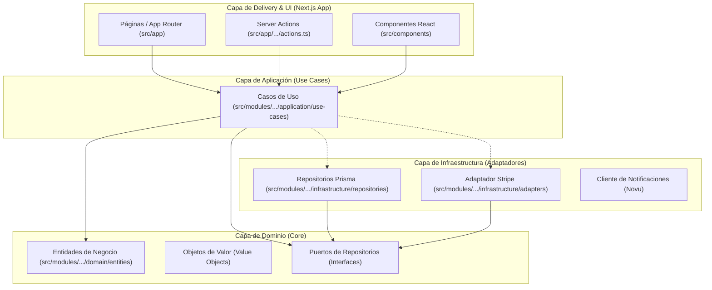
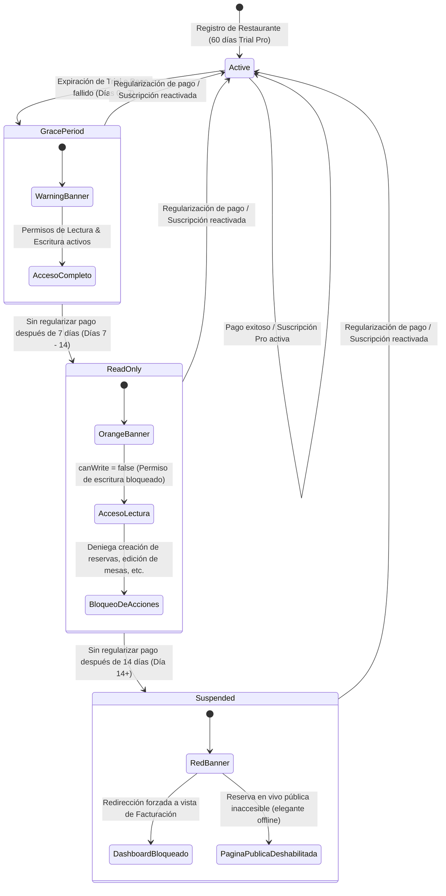

# 🌎 FullHaus SaaS — Plataforma Premium de Reservas para Restaurantes

SaaS multitenant (marca blanca) premium de nivel empresarial diseñado para la reserva en tiempo real, distribución inteligente de salas, optimización de mesas en planos interactivos y gestión operativa de restaurantes latinoamericanos.

El proyecto está diseñado bajo los principios de **Clean Architecture (Separation of Concerns)** y **Domain-Driven Design (DDD)** para garantizar la máxima portabilidad del código, mantenibilidad modular, desacoplamiento del framework (Next.js) e infraestructura (Prisma/Stripe) y una sólida separación de responsabilidades.

---

## 📐 1. Arquitectura del Sistema y Principios de Diseño

El sistema separa estrictamente la **interfaz de usuario**, la **lógica de negocio** y los **mecanismos de persistencia o servicios externos**. La lógica de negocio vive en funciones puras y casos de uso totalmente desacoplados de librerías externas o bases de datos directas.

### Diagrama de Capas (Clean Architecture)



- **Regla de oro de dependencia:** Las dependencias apuntan estrictamente hacia adentro. El **Dominio** no sabe nada de Prisma, Stripe, Next.js ni Clerk.
- **Puertos y Adaptadores:** La capa de aplicación interactúa con bases de datos o servicios externos únicamente mediante interfaces (puertos). Los adaptadores de infraestructura implementan estas interfaces.

### Mapa de Estructura de Directorios

```
D:/proyecto old/Programacion/startup-reservalatina/
├── prisma/                         # Configuración de base de datos
│   ├── schema.prisma               # Definición del esquema PostgreSQL (Prisma ORM)
│   └── reset-data.ts               # Script utilitario para purga y seeding local
├── docs/                           # Documentación técnica específica
│   └── i18n.md                     # Guía de internacionalización
├── public/                         # Recursos estáticos y multimedia
├── src/
│   ├── app/                        # Capa de entrada HTTP de Next.js (Rutas, Server Actions, Webhooks)
│   │   ├── (dashboard)/            # Vistas operativas de administración del restaurante
│   │   ├── (guest)/                # Vistas de reserva pública del restaurante (marca blanca)
│   │   ├── (admin)/                # Vistas para el superadministrador de la plataforma
│   │   └── api/v1/                 # Endpoints HTTP y Webhooks (ej. Webhook de Stripe)
│   ├── components/                 # Componentes visuales y de interfaz compartidos (UI Pura)
│   ├── constants/                  # Navegación, enums, límites de planes y constantes globales
│   ├── services/                   # Clientes compartidos de infraestructura (Prisma, Stripe, Novu)
│   ├── types/                      # Declaraciones de tipos y esquemas globales de TypeScript
│   └── modules/                    # Módulos core encapsulados por dominio
│       ├── auth/                   # Autenticación e identidades
│       ├── users/                  # Gestión de miembros, roles (RBAC) e invitaciones
│       ├── catalog/                # Gestión de zonas, mesas, restaurantes y menús
│       ├── reservations/           # Motor de reservas, huéspedes y asignación de mesas
│       └── billing/                # Facturación, planes de suscripciones y límites de uso
```

Cada módulo en `src/modules/[moduleName]/` está estructurado internamente así:

- `domain/`: Entidades de dominio, value objects e interfaces de puerto (ej. [SubscriptionRepository](file:///d:/proyecto%20old/Programacion/startup-reservalatina/src/modules/billing/domain/repositories/SubscriptionRepository.ts)).
- `application/`: Casos de uso específicos que implementan la lógica de negocio (ej. [ChangeSubscriptionPlan](file:///d:/proyecto%20old/Programacion/startup-reservalatina/src/modules/billing/application/use-cases/ChangeSubscriptionPlan/change-subscription-plan.use-case.ts)).
- `infrastructure/`: Repositorios y clientes reales de base de datos o APIs de terceros (ej. [PrismaSubscriptionRepository](file:///d:/proyecto%20old/Programacion/startup-reservalatina/src/modules/billing/infrastructure/repositories/PrismaSubscriptionRepository.ts)).

---

## 🔄 2. Flujos Críticos de Negocio y Reglas de Dominio

### A. Ciclo de Vida del Acceso y Degradación Progresiva

Al registrar un restaurante, se inicia automáticamente un periodo de prueba Pro gratuito local de **60 días sin tarjeta**. Si el periodo de prueba expira o falla un pago mensual recurrente de Stripe, el sistema de accesos entra en una secuencia de degradación progresiva:



1. **Fase de Gracia (Días 0-7):** Acceso sin interrupciones. Se muestra un banner amarillo.
2. **Fase de Solo Lectura (Días 7-14):** Permiso de escritura bloqueado (`canWrite: false`). El personal puede ver reservas existentes y configurar el plano, pero no puede registrar nuevas reservas ni modificar mesas. Se muestra un banner naranja.
3. **Fase de Suspensión (Días 14+):** Todo el dashboard redirige obligatoriamente a la sección de Facturación. La página pública del restaurante se inhabilita para evitar reservas no deseadas. Se muestra un banner rojo.

### B. Gestión de Planes de Suscripción (Upgrade/Downgrade)

- **Upgrades (Básico → Pro):** Se procesan directamente desde la aplicación. Stripe calcula el coste proporcional (prorrateo) del mes actual y realiza un cobro instantáneo a la tarjeta guardada. El cambio es inmediato e inyecta los límites actualizados en tiempo real.
- **Downgrades (Pro → Básico):** Stripe calcula la diferencia no devengada del plan Pro y la abona como **crédito interno (saldo a favor)** en la cuenta del cliente. Este saldo se deducirá automáticamente de la próxima factura del plan Básico.
- **Autogestión de Facturación (Stripe Customer Portal):** El sistema expone un portal seguro de Stripe donde el usuario puede:
  - Descargar facturas históricas en PDF.
  - Actualizar métodos de pago y tarjetas.
  - Añadir datos fiscales específicos (CIF/NIF, dirección comercial, etc.).

### C. Sistema de Permisos Basado en Roles (RBAC)

El acceso al dashboard está controlado por roles a nivel de membresía de restaurante:

| Rol                        | Gestión de Mesas y Zonas | Gestión de Reservas y Agenda | CRM / Clientes | Facturación y Planes | Configuración General |
| :------------------------- | :-----------------------: | :---------------------------: | :------------: | :-------------------: | :--------------------: |
| **RESTAURANT_OWNER** |            SÍ            |              SÍ              |      SÍ      |          SÍ          |          SÍ          |
| **MANAGER**          |            SÍ            |              SÍ              |      SÍ      |          NO          |          SÍ          |
| **STAFF_WAITER**     |     NO (Solo lectura)     |              SÍ              |      SÍ      |          NO          |           NO           |
| **STAFF_BAR**        |            NO            |      SÍ (Solo consulta)      |       NO       |          NO          |           NO           |
| **STAFF_KITCHEN**    |            NO            |      NO (Solo timeline)      |       NO       |          NO          |           NO           |

---

## 🛠️ 3. Stack Tecnológico

- **Framework Core:** [Next.js 16](https://nextjs.org/) (App Router & React 19) con Server Actions y React Server Components nativos.
- **Estilos y UI:** [Tailwind CSS v4](https://tailwindcss.com/) configurado con diseño premium responsive y animaciones micro-interactivas.
- **Base de Datos y ORM:** [Prisma 7](https://www.prisma.io/) como ORM integrado sobre base de datos relacional serverless en [Neon (PostgreSQL)](https://neon.tech/).
- **Seguridad y Autenticación:** [Clerk Auth](https://clerk.com/) para gestión de sesiones multi-restaurante seguras y control de accesos.
- **Pagos y Facturación:** [Stripe Billing](https://stripe.com/) administrando Checkout, Webhooks y Customer Portal.
- **Testing:** [Vitest](https://vitest.dev/) para suite de tests rápidos.
- **Calidad de Código:** [ESLint](https://eslint.org/) para control de buenas prácticas estáticas.

---

## 📡 4. Observabilidad y Monitoreo en Producción

### Sentry — Monitoreo de Errores y Rendimiento

La aplicación integra [Sentry](https://sentry.io) para captura automática de errores, trazado de rendimiento y reproducción de sesiones en producción.

**Qué monitoriza:**
- Errores no controlados en Server Actions, API Routes y componentes cliente
- Trazas de rendimiento (Tracing) para detectar cuellos de botella
- Session Replay para reproducir visualmente la sesión de un usuario cuando ocurre un error
- Logs de aplicación enviados directamente a Sentry

**Archivos de configuración:**
- sentry.server.config.ts — inicialización en el servidor (Node.js runtime)
- sentry.edge.config.ts — inicialización en el edge runtime (middleware)
- src/instrumentation.ts — punto de entrada de instrumentación de Next.js
- src/instrumentation-client.ts — inicialización en el cliente (browser)
- src/app/global-error.tsx — captura de errores globales no controlados de React

**Variables de entorno requeridas:**

`nv
# Token de autenticación para subir source maps durante el build (solo build time, nunca runtime)
SENTRY_AUTH_TOKEN="sntrys_..."
`

> ⚠️ El SENTRY_AUTH_TOKEN debe añadirse como variable de entorno en Vercel pero **nunca** commitearse al repositorio. Ya está incluido en .gitignore automáticamente.

**Dashboard de monitoreo:** [fullhaus.sentry.io](https://fullhaus.sentry.io)

**Estado actual en producción:** ✅ Activo — Crash Free Rate 100%

---

## 🚀 5. Guía de Inicio Rápido para Desarrollo

### 1. Prerrequisitos

- **Node.js** v20 o superior.
- **pnpm** v9 o superior (Gestor de paquetes recomendado).
- **Stripe CLI** (Para depurar y simular webhooks de pagos localmente).

### 2. Configuración de Variables de Entorno

Crea un archivo `.env` en la raíz del proyecto y completa los parámetros obligatorios:

```env
# URL de la aplicación
NEXT_PUBLIC_APP_URL="http://localhost:3000"

# Base de Datos (Neon / PostgreSQL)
DATABASE_URL="postgresql://postgres:URL DE LA BASE DE DATOS"

# Autenticación (Clerk)
NEXT_PUBLIC_CLERK_PUBLISHABLE_KEY="pk_test_..."
CLERK_SECRET_KEY="sk_test_..."

# Configuración de Pasarela de Pagos (Stripe)
STRIPE_SECRET_KEY="sk_test_..."
STRIPE_WEBHOOK_SECRET="whsec_..."
STRIPE_BASIC_PRICE_ID="price_1Q..."
STRIPE_PRO_PRICE_ID="price_1Q..."

# Proveedor de Notificaciones Multicanal (Novu)
NOVU_API_KEY="db..."
```

### 3. Instalación de Dependencias e Inicialización de BD

````bash
# 1. Instalar dependencias
pnpm install

# 2. Sincronizar esquema de base de datos con Neon
pnpm prisma db push

# 3. Generar cliente de Prisma compilado
pnpm prisma generate


### 4. Lanzar Entorno Local de Desarrollo

Para habilitar el flujo completo de pagos, debes arrancar Next.js y el túnel local de Stripe CLI simultáneamente:

```bash
# Terminal 1: Iniciar Next.js en modo desarrollo
pnpm dev

# Terminal 2: Escuchar webhooks locales de Stripe y redirigirlos a tu endpoint
stripe listen --forward-to localhost:3000/api/v1/billing/webhook
````

El panel de administración estará disponible en `http://localhost:3000/dashboard`.

---

## 🧪 6. Suite de Pruebas y Control de Calidad

El proyecto implementa desarrollo defensivo estricto. Toda lógica de dominio crítica debe contar con cobertura de pruebas automatizadas en Vitest.

```bash
# Ejecutar suite completa de tests unitarios y de integración
pnpm test run

# Lanzar linter estático de ESLint para asegurar sintaxis e importaciones limpias
pnpm lint

# Verificar compilación estricta de TypeScript
npx tsc --noEmit
```

---

## 📜 7. Reglas de Oro de Desarrollo (Cumplimiento Obligatorio)

Si vas a colaborar o modificar este repositorio, debes seguir estas directrices sin excepción:

### 1. Cabecera Informativa de Archivos

Todo archivo debe iniciar con una cabecera JSDoc que describa claramente su rol y tipo:

```typescript
/**
 * Archivo: NombreDelArchivo.ts
 * Responsabilidad: Explicación de la tarea principal de este archivo.
 * Tipo: UI | lógica | servicio | hook | caso de uso
 */
```

### 2. Delimitadores de Funciones

Las funciones principales deben delimitarse de manera explícita para facilitar el análisis visual:

```typescript
//-aqui empieza funcion registrarReserva y es para guardar reservas en bd-//
export async function registrarReserva(...) {
  ...
}
//-aqui termina funcion registrarReserva-//
```

### 3. JSDoc e Indicadores de Efectos Secundarios

Declara de forma explícita el comportamiento de los métodos:

- `@pure` si la función es pura (misma entrada produce misma salida, no altera estado exterior).
- `@sideEffect` si la función interactúa con APIs externas, modifica base de datos, envía emails o genera mutaciones de estado persistente.

### 4. Convenciones de Nombres

- `camelCase` para variables, funciones, propiedades y Server Actions.
- `PascalCase` para componentes React, entidades de negocio y Value Objects.
- `UPPER_CASE` para constantes y variables de entorno.
- **Puertos y Adaptadores:**
  - Puertos (interfaces en dominio) llevan el nombre de la acción o repositorio: `SubscriptionRepository`.
  - Adaptadores de infraestructura llevan sufijo técnico: `PrismaSubscriptionRepository`, `StripeSubscriptionAdapter`.
- **Casos de uso:** Nombrados en `PascalCase` comenzando con un verbo de acción: `ChangeSubscriptionPlan`, `SyncStripeWebhook`.

### 5. Estilo de Código y Retornos Tempranos (Early Return)

- **KISS:** Priorizar legibilidad sobre abstracciones sofisticadas e innecesarias.
- **Early Return:** Evitar bloques `if-else` anidados. Valida condiciones de error o salida inmediatamente y retorna temprano.
- **Barrels (index.ts):** Prohibido el uso de archivos `index.ts` que actúen como barriles entre capas diferentes de la arquitectura. Solo se permiten barriles en subcarpetas del mismo nivel técnico para simplificar importaciones.

---

_Diseñado con dedicación y trabajo duro por y para la industria gastronomica._

    Desarrollador: LuckyDev
